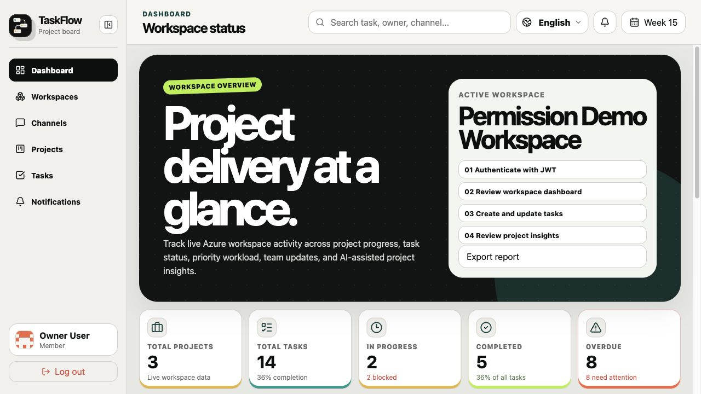
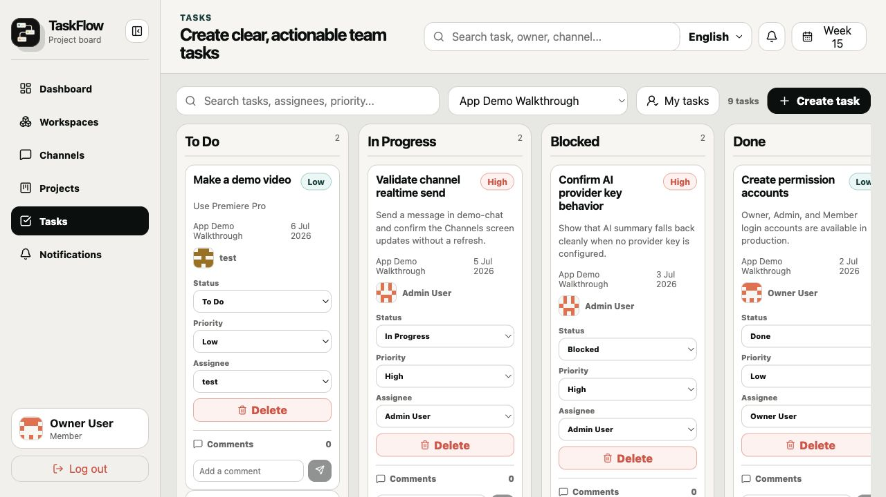
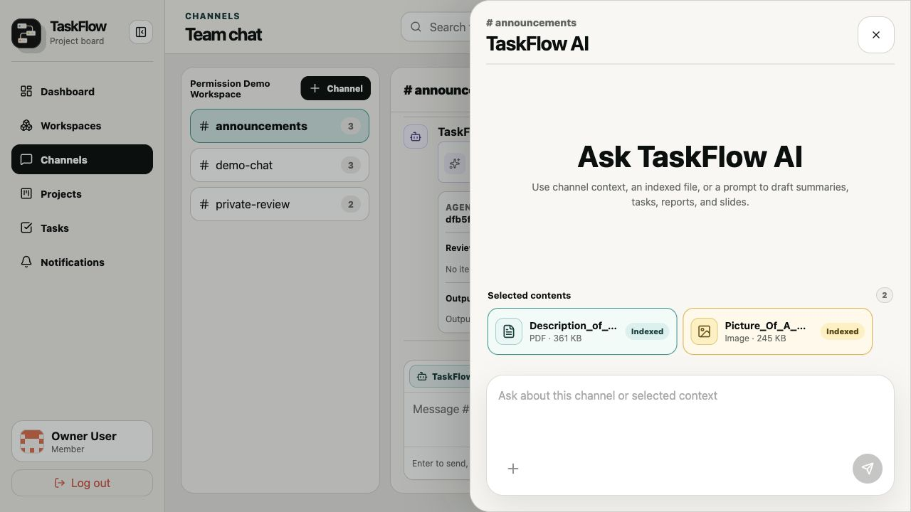
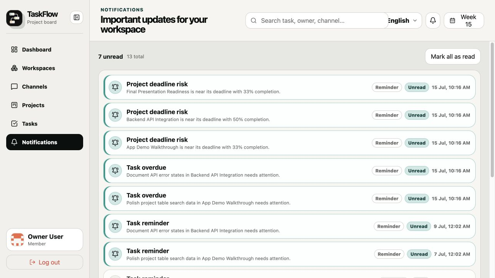
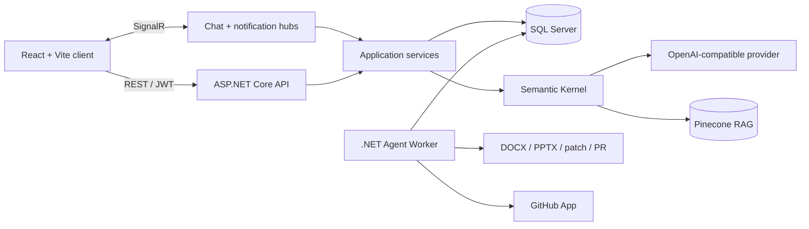

<div align="center">
  

  <h1>TaskFlow Connect</h1>

  <p><strong>AI-assisted project collaboration with real-time channels, permission-aware workflows, and grounded workspace context.</strong></p>

  <p>
    
    
    
    
  </p>

  <p>
    <a href="https://drive.google.com/file/d/14ktPkSDiBMY9mMcM8AtcEXToi9LFh3Tk/view?usp=sharing"><strong>Demo Video</strong></a>
    ·
    <a href="https://github.com/WalterCQ/SWE310-FinalProject/actions/workflows/azure-backend.yml"><strong>Azure Pipeline Archive</strong></a>
  </p>
</div>

---

TaskFlow Connect is a full-stack collaboration platform built for teams that need project tracking, channel communication, and AI assistance to share the same source of truth. Instead of treating AI as a separate chatbot, TaskFlow grounds summaries and actions in workspace permissions, messages, tasks, attachments, and project records.

> **Current demo:** the cloud resources were intentionally decommissioned after the coursework delivery. The application now runs locally with SQL Server, ASP.NET Core, and Vite. The repository retains the former Azure Container Registry/App Service workflow as deployment evidence.

## Product walkthrough

The screenshots below were captured from the locally running application using the database restored from the final Azure BACPAC—not generated UI mockups.

<table>
  <tr>
    <td width="50%">
      
      <br /><sub><strong>Dashboard</strong> — workspace-level delivery metrics and status visibility.</sub>
    </td>
    <td width="50%">
      
      <br /><sub><strong>Task workflow</strong> — project-scoped status, ownership, priority, and comments.</sub>
    </td>
  </tr>
  <tr>
    <td width="50%">
      
      <br /><sub><strong>Grounded AI</strong> — channel context and indexed attachments share one AI workspace.</sub>
    </td>
    <td width="50%">
      
      <br /><sub><strong>Notifications</strong> — actionable reminders with read-state persistence.</sub>
    </td>
  </tr>
</table>

## Engineering highlights

| Area | What is implemented | Why it matters |
| --- | --- | --- |
| **Access control** | JWT authentication plus global, workspace, and project roles enforced by protected routes and backend permission services | Authorization follows the data boundary instead of relying on hidden UI controls |
| **Real-time collaboration** | SignalR chat and notification hubs, channel membership checks, attachments, and persistent messages | Teams receive live updates while SQL Server remains the system of record |
| **Grounded AI** | Microsoft Semantic Kernel plugins, OpenAI-compatible providers, encrypted API-key storage, and Pinecone-backed attachment retrieval | AI responses can use relevant workspace context without bypassing permissions |
| **Long-running agent work** | A separate .NET worker processes queued jobs, approval gates, events, and DOCX/PPTX/patch/pull-request artifacts | Expensive work is observable and resumable instead of blocking an HTTP request |
| **Delivery** | EF Core migrations, Docker Compose, and an archived Azure Container Registry/App Service workflow | The repository preserves the path used to move the project from local development to its coursework deployment |

## System design



The API owns authentication, authorization, validation, and domain operations. SignalR reuses the same JWT identity model for live connections. Agent jobs are persisted in SQL Server and handled by a separate worker so approvals, progress events, and artifacts survive beyond one request.

## Tech stack

- **Frontend:** React, Vite, React Router, Axios, SignalR client, Recharts, Motion, React Markdown
- **Backend:** ASP.NET Core 10, Entity Framework Core, SQL Server, SignalR, Swagger/OpenAPI
- **AI and agents:** Microsoft Semantic Kernel, OpenAI-compatible providers, Pinecone, Microsoft Agents AI, Open XML SDK
- **Infrastructure:** Docker Compose; archived Azure Container Registry, Azure App Service, and GitHub Actions deployment configuration

## Run locally

### Prerequisites

- .NET SDK 10
- Node.js 20.19+ and npm
- Docker Desktop, or an existing SQL Server instance

### 1. Start SQL Server

```bash
git clone https://github.com/WalterCQ/SWE310-FinalProject.git
cd SWE310-FinalProject
docker compose up -d sqlserver
```

Wait until `docker compose logs sqlserver` reports that SQL Server is ready for client connections.

### 2. Start the API

```bash
cd backend/TaskFlow.Api
ASPNETCORE_ENVIRONMENT=Development \
Database__MigrateOnStartup=true \
ConnectionStrings__DefaultConnection="Server=localhost,1433;Database=TaskFlowConnectDb;User Id=sa;Password=YourStrong!Passw0rd;TrustServerCertificate=True;" \
dotnet run --launch-profile http
```

The API and Swagger UI will be available at `http://localhost:5134/swagger`.

### 3. Start the React client

```bash
cd frontend
npm ci
VITE_DEV_PROXY_TARGET=http://localhost:5134 npm run dev
```

Open `http://localhost:5173`, register an account, and create or join a workspace. AI and GitHub features require their corresponding provider configuration; core collaboration features do not.

## Repository map

```text
backend/
├── TaskFlow.Api/          REST API, SignalR hubs, EF Core, permissions, AI services
└── TaskFlow.AgentWorker/  queued jobs, approvals, skills, and artifact generation
frontend/                  React application and localized product UI
deploy/                    production container and startup configuration
screenshots/               real product evidence used in this README
tools/                     agent skills and demo-data utilities
.github/workflows/         backend validation and Azure deployment
```

## API surface

The API covers authentication, workspaces, members, channels, messages, projects, tasks, notifications, AI providers, agent jobs, and GitHub repository connections. Business endpoints use a shared response envelope and document authentication, validation, permission, and not-found outcomes in Swagger.

For an interactive view, run the stack and open Swagger UI at `http://localhost:5134/swagger`.

---

<div align="center">
  <sub>Built as a SWE310 full-stack engineering project · Team 5</sub>
</div>
