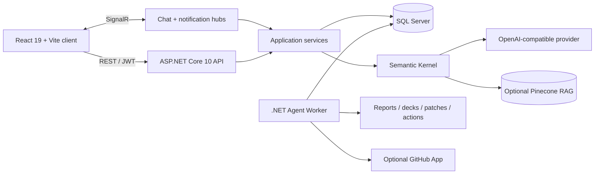

<div align="center">
  

  <h1>TaskFlow Connect</h1>

  <p><strong>Permission-aware project collaboration, real-time channels, and workspace-grounded AI in one full-stack application.</strong></p>

  <p>
    
    
    
    
    
  </p>

  <p>
    <a href="https://drive.google.com/file/d/14ktPkSDiBMY9mMcM8AtcEXToi9LFh3Tk/view?usp=sharing"><strong>Demo Video</strong></a>
    ·
    <a href="https://github.com/WalterCQ/SWE310-FinalProject/actions/workflows/azure-backend.yml"><strong>Azure Deployment Workflow</strong></a>
  </p>
</div>

> **Status:** SWE310 Final Project and portfolio build. The app runs locally; its former Azure resources are decommissioned, and no live production service is claimed.

## Overview

TaskFlow Connect combines workspaces, projects, Kanban tasks, real-time channels, notifications, and permission-aware AI. A React client connects to an ASP.NET Core API and SQL Server, while a separate worker handles long-running agent jobs and generated artifacts.

## Interface showcase

Real local application states captured at 1440×900 with the repository's demo data.

<p align="center">
  
  <br /><sub><strong>Dashboard</strong> · progress, workload, activity, and deadline risk</sub>
</p>

<table>
  <tr>
    <td width="50%">
      
      <br /><sub><strong>Authentication</strong> · JWT sign-in</sub>
    </td>
    <td width="50%">
      
      <br /><sub><strong>Workspaces</strong> · members, roles, AI, and GitHub</sub>
    </td>
  </tr>
  <tr>
    <td width="50%">
      
      <br /><sub><strong>Channels</strong> · live messages and attachments</sub>
    </td>
    <td width="50%">
      
      <br /><sub><strong>TaskFlow AI</strong> · workspace-grounded assistance</sub>
    </td>
  </tr>
  <tr>
    <td width="50%">
      
      <br /><sub><strong>Projects</strong> · ownership, progress, and deadlines</sub>
    </td>
    <td width="50%">
      
      <br /><sub><strong>Tasks</strong> · Kanban, priority, and assignment</sub>
    </td>
  </tr>
  <tr>
    <td width="50%">
      
      <br /><sub><strong>Notifications</strong> · updates, reminders, and AI events</sub>
    </td>
    <td width="50%">
      
      <br /><sub><strong>Administration</strong> · metrics, roles, and accounts</sub>
    </td>
  </tr>
</table>

## Key features

| Area | Included |
| --- | --- |
| **Delivery** | Workspaces, projects, Kanban tasks, comments, deadlines, dashboards, and CSV export |
| **Communication** | Public/private channels, attachments, and SignalR chat and notification updates |
| **AI** | Semantic Kernel tools, summaries, risk analysis, channel context, and optional Pinecone retrieval |
| **Agents** | Persisted jobs, approvals, progress events, cancellation, and generated artifacts |
| **Platform** | JWT auth, scoped permissions, administration, EF Core migrations, and Swagger |

## Access model

- Global roles: `Administrator` and `Member`.
- Workspace/project roles: `Administrator`, `Manager`, and `Member`.
- Private channels require explicit membership.
- Backend services enforce the same scope for UI, API, AI, and agent actions.

## Architecture



The API owns authentication, permissions, domain operations, and live hubs. Agent jobs remain observable in SQL Server while the worker processes them independently.

## Stack

- **Frontend:** React 19.2, Vite 8.1, React Router, SignalR, and Recharts
- **Backend:** ASP.NET Core 10, EF Core 10, SQL Server, Swagger, and SignalR
- **AI/agents:** Semantic Kernel, Microsoft Agents AI, optional Pinecone and GitHub App integrations
- **Delivery:** Docker Compose, Dockerfile, migrations, and a retained Azure deployment workflow

## Run locally

Prerequisites: .NET SDK 10, Node.js 20.19+, npm, and Docker Desktop (or another SQL Server).

### 1. Clone and start SQL Server

```bash
git clone https://github.com/WalterCQ/SWE310-FinalProject.git
cd SWE310-FinalProject
docker compose up -d sqlserver
```

### 2. Start the API

```bash
dotnet run --project backend/TaskFlow.Api/TaskFlow.Api.csproj --launch-profile http
```

### 3. Seed the local portfolio dataset

```bash
TASKFLOW_AZURE_SQL_CONNECTION_STRING="<local SQL Server connection string>" \
dotnet run --project tools/TaskFlow.DemoDataSeeder/TaskFlow.DemoDataSeeder.csproj
```

The legacy variable name is retained for compatibility. The seeder prints local-only demo credentials; do not reuse them elsewhere.

### 4. Start the frontend

```bash
cd frontend
npm ci
npm run dev
```

Open `http://localhost:5173`. Swagger is available at `http://localhost:5134/swagger`.

<details>
<summary><strong>Optional: start the agent worker</strong></summary>

Use a separate terminal for queued jobs, approvals, and generated artifacts:

```bash
ConnectionStrings__DefaultConnection="<local SQL Server connection string>" \
dotnet run --project backend/TaskFlow.AgentWorker/TaskFlow.AgentWorker.csproj
```

The main web flow works without it. Some artifact skills also require `python3.12`.

</details>

<details>
<summary><strong>Optional configuration</strong></summary>

Start from `backend/TaskFlow.Api/appsettings.Development.example.json` and supply secrets through environment variables, .NET user secrets, or ignored local settings.

| Feature | Settings |
| --- | --- |
| Database/JWT | `ConnectionStrings__DefaultConnection`, `Jwt__SigningKey` |
| AI | `AI__Provider`, `AI__BaseUrl`, `AI__Model`, `AI__ApiKey` |
| Retrieval | `Pinecone__Enabled`, `Pinecone__ApiKey`, `Pinecone__IndexName` |
| GitHub App | `GitHub__AppId`, `GitHub__PrivateKeyPath`, `GitHub__WebhookSecret` |
| Frontend | `VITE_DEV_PROXY_TARGET`, `VITE_API_BASE_URL` |

Never commit API keys, signing keys, database credentials, or private keys.

</details>

## Project status

- Built and submitted as the SWE310 Final Project; maintained as coursework and portfolio evidence.
- The Azure workflow remains as delivery evidence, but its former cloud resources are decommissioned.
- This is not presented as a currently operated production SaaS.

---

<div align="center">
  <sub>SWE310 Final Project · Team 5</sub>
</div>
