<div align="center">
  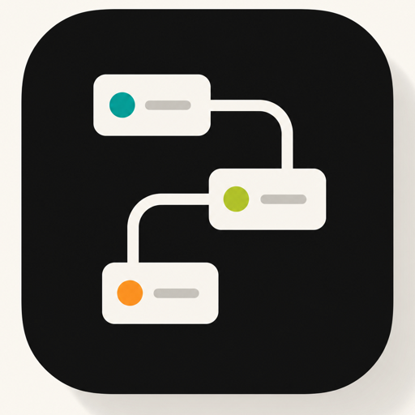

  <h1>TaskFlow Connect</h1>

  <p><strong>Permission-aware project collaboration, real-time channels, and workspace-grounded AI in one full-stack application.</strong></p>

  <p>
    
    
    
    
    
  </p>

  <p>
    <a href="https://drive.google.com/file/d/14ktPkSDiBMY9mMcM8AtcEXToi9LFh3Tk/view?usp=sharing"><strong>Demo Video</strong></a>
    ·
    <a href="https://github.com/WalterCQ/SWE310-FinalProject/actions/workflows/azure-backend.yml"><strong>Azure Deployment Workflow</strong></a>
  </p>
</div>

> **Portfolio status:** TaskFlow Connect is a SWE310 coursework and portfolio build. Its former Azure resources have been decommissioned, so this repository documents a locally runnable system rather than an active public production service.

## Product overview

TaskFlow Connect brings project planning, task ownership, team channels, notifications, and AI-assisted workflows into the same permission boundary. Workspace records remain the source of truth: the assistant and long-running agents operate on the same projects, tasks, messages, attachments, and memberships that users can access.

The application includes a React client, an ASP.NET Core API, a separate .NET agent worker, SQL Server persistence, SignalR updates, Swagger documentation, and optional OpenAI-compatible, Pinecone, and GitHub App integrations.

## Interface showcase

These screenshots were captured from the locally running application at a 1440×900 viewport after applying EF Core migrations and running the repository's existing demo-data seeder. They are real application states, not generated mockups.

<p align="center">
  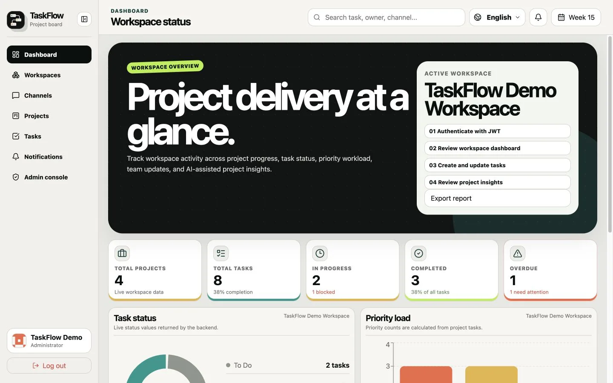
  <br /><sub><strong>Workspace dashboard</strong> — delivery metrics, status distribution, priorities, progress, and deadline risk from SQL Server records.</sub>
</p>

<table>
  <tr>
    <td width="50%">
      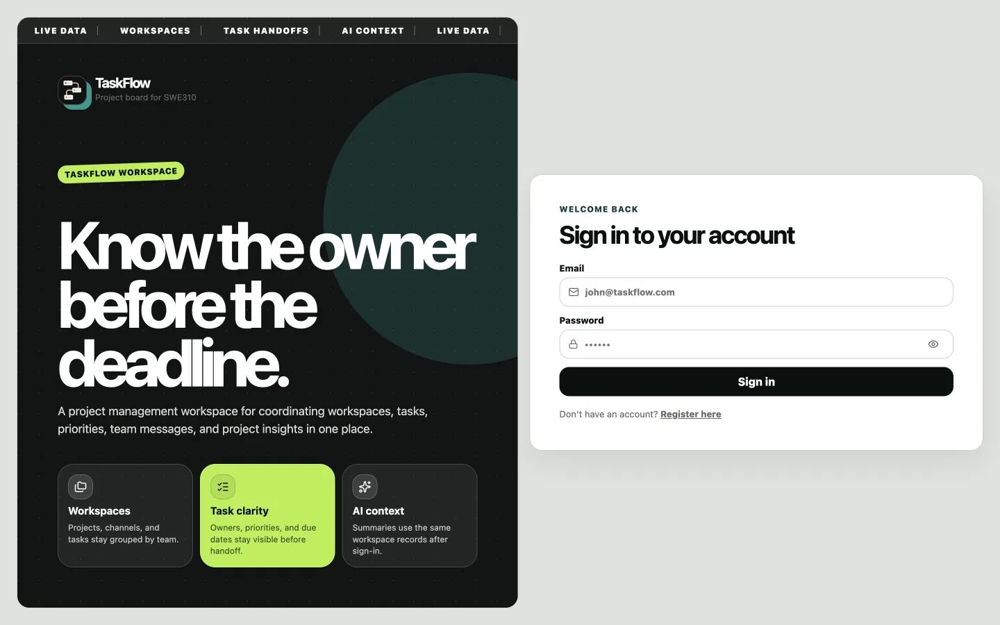
      <br /><sub><strong>Authentication</strong> — focused sign-in experience backed by JWT authentication.</sub>
    </td>
    <td width="50%">
      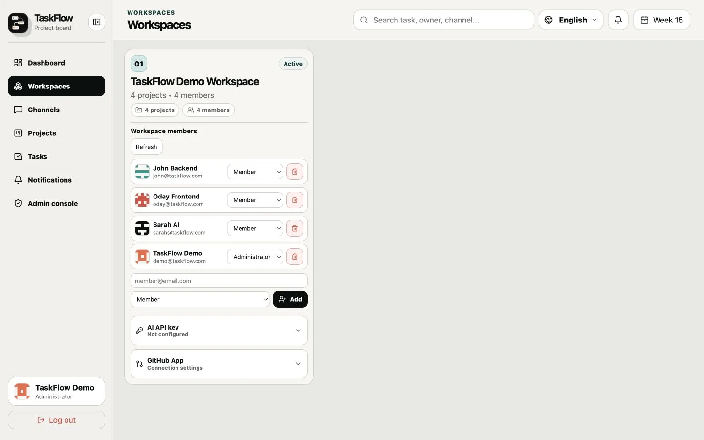
      <br /><sub><strong>Workspaces</strong> — scoped membership, roles, AI provider settings, and repository connections.</sub>
    </td>
  </tr>
  <tr>
    <td width="50%">
      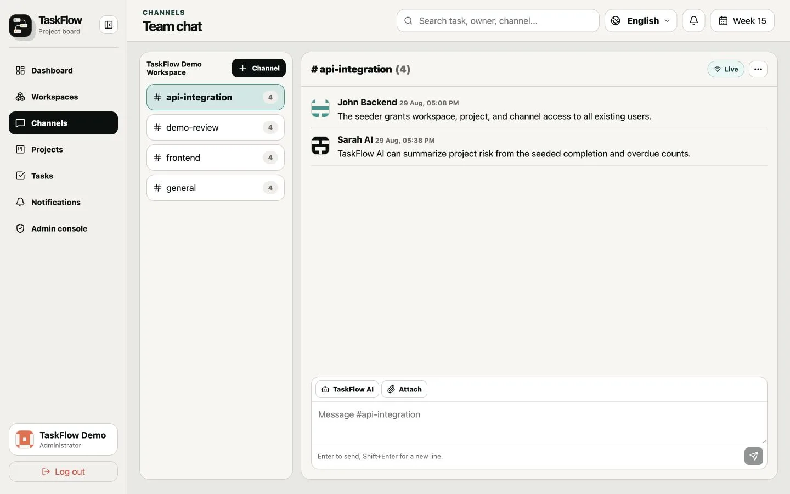
      <br /><sub><strong>Channels</strong> — persistent team messages, private-channel checks, attachments, and SignalR updates.</sub>
    </td>
    <td width="50%">
      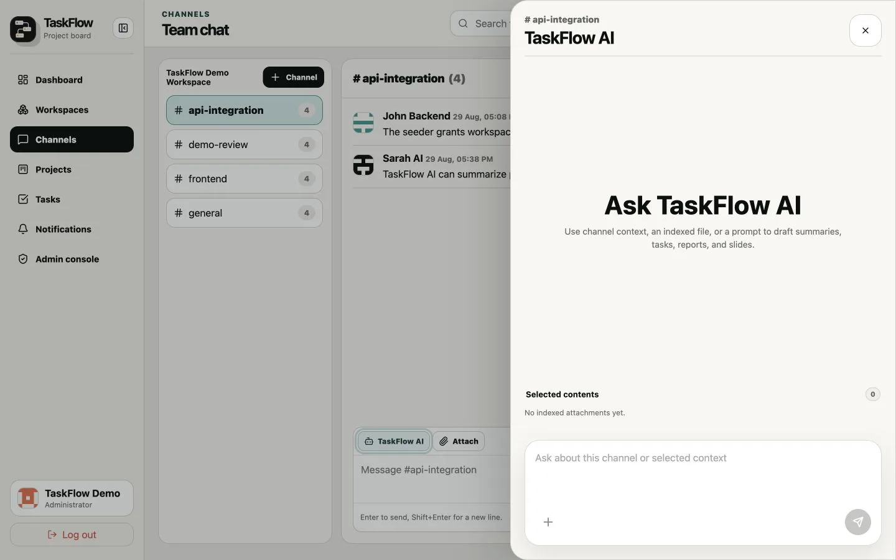
      <br /><sub><strong>TaskFlow AI</strong> — contextual requests launched beside the channel and its indexed content.</sub>
    </td>
  </tr>
  <tr>
    <td width="50%">
      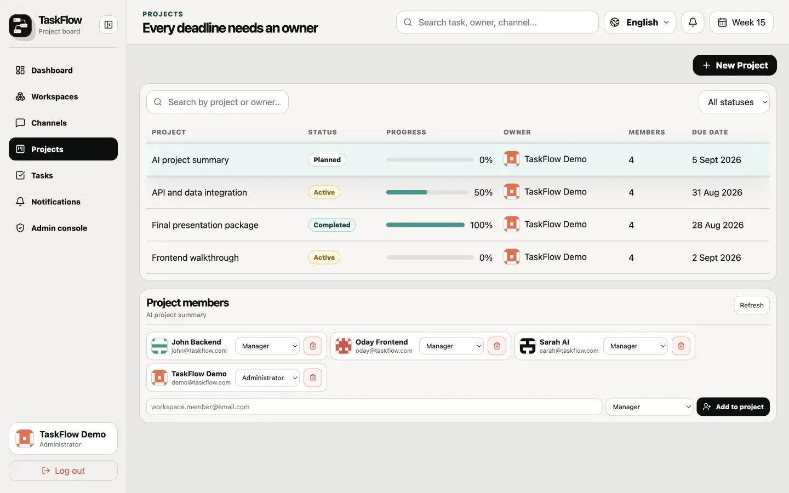
      <br /><sub><strong>Projects</strong> — ownership, deadlines, progress, membership, and role management.</sub>
    </td>
    <td width="50%">
      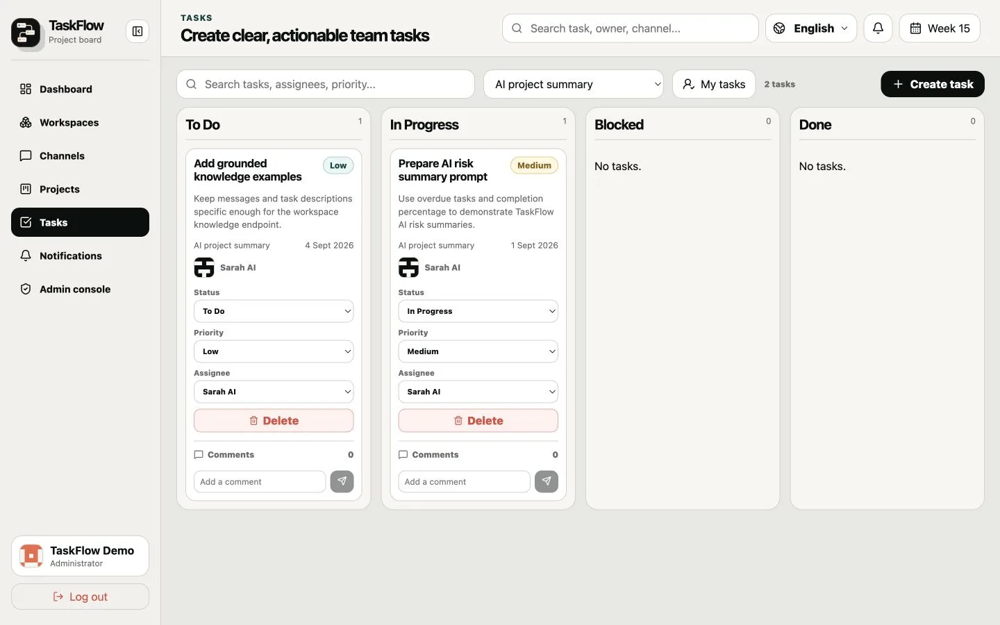
      <br /><sub><strong>Tasks</strong> — project-scoped Kanban workflow with priority, assignment, status, and comments.</sub>
    </td>
  </tr>
  <tr>
    <td width="50%">
      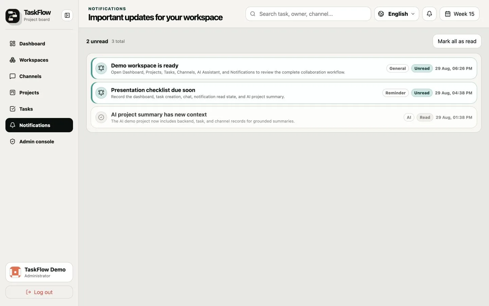
      <br /><sub><strong>Notifications</strong> — collaboration updates, reminders, AI events, and persistent read state.</sub>
    </td>
    <td width="50%">
      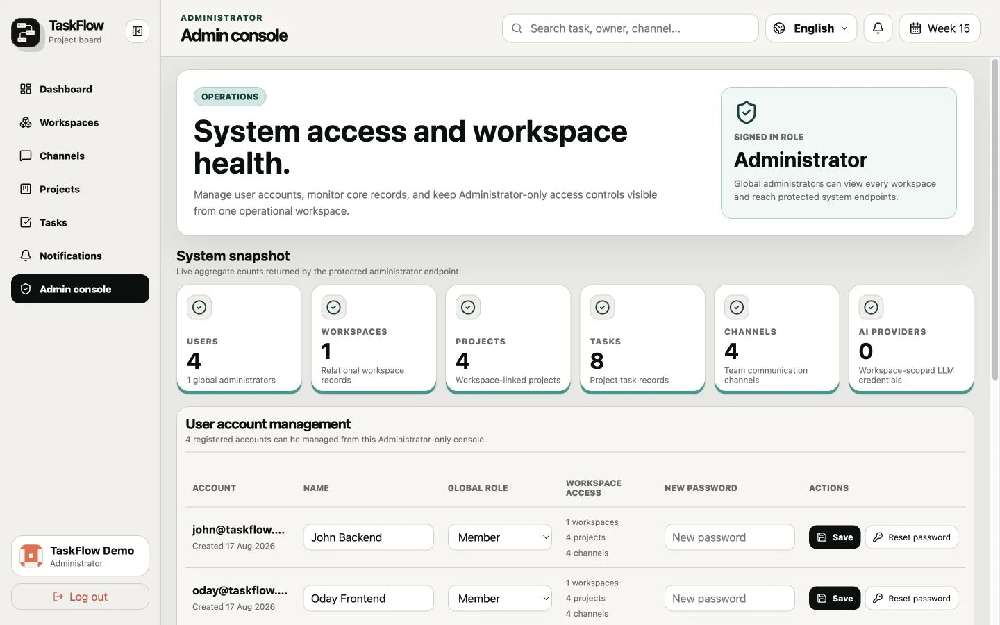
      <br /><sub><strong>Administration</strong> — protected system metrics, user roles, and account operations.</sub>
    </td>
  </tr>
</table>

## Core capabilities

| Area | Implemented behavior |
| --- | --- |
| **Project delivery** | Workspaces, projects, Kanban tasks, priorities, assignees, comments, deadlines, dashboards, CSV export, and activity history |
| **Team communication** | Public and private channels, persistent messages, membership controls, attachments, and SignalR chat/notification hubs |
| **TaskFlow AI** | Workspace-scoped provider credentials, Semantic Kernel plugins, project summaries, risk analysis, channel context, and optional Pinecone retrieval |
| **Agent workflows** | Persisted jobs, sub-jobs, approval gates, progress events, cancellation, and generated report, deck, code-patch, and TaskFlow-action artifacts |
| **Administration** | Administrator-only overview and user management, current-role validation, and frontend route protection |
| **API quality** | JWT authentication, shared response envelopes, DTO validation, permission services, EF Core migrations, and documented Swagger responses |

## Permission model

Authorization is enforced in both routing and backend services; hiding a control in the UI is not treated as the security boundary.

| Scope | Roles or membership | Enforced behavior |
| --- | --- | --- |
| **Global** | `Administrator`, `Member` | Global administrators can access the protected admin surface and bypass scoped membership checks; members rely on workspace relationships. |
| **Workspace** | `Administrator`, `Manager`, `Member` | Administrators and managers can manage a workspace; members can access workspace content they belong to. |
| **Project** | `Administrator`, `Manager`, `Member` | Project access follows workspace access. Management requires a workspace management role or the project's Administrator role. |
| **Channel** | Workspace access plus private-channel membership | Workspace members can access public channels; private channels require explicit membership unless the user is a global administrator. |
| **AI and agents** | Workspace access plus provider capability checks | AI commands stay inside the user's workspace boundary, while provider and repository settings use their own management checks. |

## Architecture

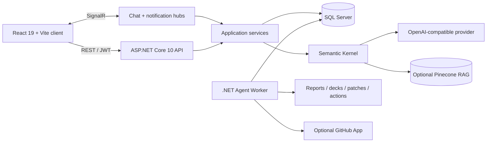

The API owns authentication, authorization, validation, domain operations, and live hubs. Agent jobs are stored in SQL Server and processed by a separate worker so approvals, progress events, failures, and artifacts remain observable beyond a single HTTP request.

## Technology stack

| Layer | Technology |
| --- | --- |
| **Frontend** | React 19.2, Vite 8.1, React Router, Axios, SignalR client, Recharts, Motion, React Markdown |
| **Backend** | ASP.NET Core 10, Entity Framework Core 10, SQL Server, SignalR, Swagger/OpenAPI |
| **AI and retrieval** | Microsoft Semantic Kernel, OpenAI-compatible providers, Pinecone client, workspace-scoped encrypted provider credentials |
| **Agent runtime** | .NET Worker Service, Microsoft Agents AI, Open XML SDK, persisted approvals/events/artifacts |
| **Delivery evidence** | Docker Compose, backend Dockerfile, EF Core migrations, and a retained Azure Container Registry/App Service workflow; associated cloud resources are archived |

## Run locally

### Prerequisites

- .NET SDK 10
- Node.js 20.19+ and npm
- Docker Desktop, or another reachable SQL Server instance

### 1. Clone and start SQL Server

```bash
git clone https://github.com/WalterCQ/SWE310-FinalProject.git
cd SWE310-FinalProject
docker compose up -d sqlserver
```

Wait until `docker compose logs sqlserver` reports that SQL Server is ready for client connections.

### 2. Start the API

```bash
dotnet run --project backend/TaskFlow.Api/TaskFlow.Api.csproj --launch-profile http
```

The API applies pending migrations in Development and exposes Swagger UI at `http://localhost:5134/swagger`.

### 3. Seed the local portfolio dataset

The existing seeder accepts a SQL Server connection through `TASKFLOW_AZURE_SQL_CONNECTION_STRING` (the legacy variable name is retained for compatibility):

```bash
TASKFLOW_AZURE_SQL_CONNECTION_STRING="<local SQL Server connection string>" \
dotnet run --project tools/TaskFlow.DemoDataSeeder/TaskFlow.DemoDataSeeder.csproj
```

Use the same local connection string as the API. The seeder prints local-only demo credentials to the terminal and grants the seeded accounts access to the shared workspace; do not reuse those credentials elsewhere.

### 4. Start the frontend

```bash
cd frontend
npm ci
npm run dev
```

Open `http://localhost:5173` and sign in with a local account printed by the seeder, or register a new account after seeding to join the shared demo workspace. The development proxy targets `http://localhost:5134` by default; set `VITE_DEV_PROXY_TARGET` only when the API runs elsewhere.

### 5. Start the agent worker (optional)

Run the worker in a separate terminal when testing queued agent jobs, approval flows, or generated artifacts:

```bash
ConnectionStrings__DefaultConnection="<local SQL Server connection string>" \
dotnet run --project backend/TaskFlow.AgentWorker/TaskFlow.AgentWorker.csproj
```

The main web collaboration flow works without the worker. Some artifact-generation skills also require the configured `python3.12` executable.

## Configuration

Copy values from `backend/TaskFlow.Api/appsettings.Development.example.json` into environment variables, .NET user secrets, or an ignored local settings file as needed.

| Setting | Purpose |
| --- | --- |
| `ConnectionStrings__DefaultConnection` | SQL Server connection used by the API, agent worker, and EF Core migrations |
| `Jwt__SigningKey` | JWT signing secret; required outside Development |
| `AI__Provider`, `AI__BaseUrl`, `AI__Model`, `AI__ApiKey` | OpenAI-compatible provider selection and credentials |
| `Pinecone__Enabled`, `Pinecone__ApiKey`, `Pinecone__IndexName` | Optional attachment retrieval configuration |
| `GitHub__AppId`, `GitHub__PrivateKeyPath`, `GitHub__WebhookSecret` | Optional GitHub App integration for repository-backed jobs |
| `VITE_DEV_PROXY_TARGET`, `VITE_API_BASE_URL` | Frontend development proxy or explicit API base URL |

Supply credentials at runtime through environment variables, .NET user secrets, or ignored local settings; never commit API keys, signing keys, database credentials, or GitHub private keys.

## Repository structure

```text
backend/
├── TaskFlow.Api/          REST API, SignalR hubs, EF Core, permissions, AI services
└── TaskFlow.AgentWorker/  queued jobs, approvals, skills, and artifact generation
frontend/                  React application and English, Chinese, and Tajik UI copy
deploy/                    backend container and startup configuration
screenshots/               verified 1440×900 WebP portfolio captures
tools/                     demo-data seeder and agent-support tooling
.github/workflows/         validation and retained Azure deployment workflow
docker-compose.yml         local API, SQL Server, and optional Redis services
```

## Project status

- Built and submitted as the SWE310 Final Project; maintained here as coursework and portfolio evidence.
- The React client, API, worker, migrations, SQL Server workflow, and demo data can be run locally.
- The Azure deployment workflow remains enabled as delivery evidence, while the former App Service and database are decommissioned and are not advertised as live endpoints.
- This repository is not presented as a currently operated production SaaS. Production operations would still require managed secrets, monitoring, backups, load testing, and remediation of any outstanding dependency advisories.

---

<div align="center">
  <sub>SWE310 Final Project · Team 5</sub>
</div>
