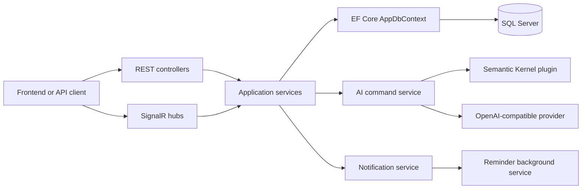

# TaskFlow Connect Backend

TaskFlow Connect is an ASP.NET Core Web API backend for a university group project. It supports workspaces, channels, messages, projects, tasks, notifications, SignalR hubs, and a Semantic Kernel AI service layer.

Repository: https://github.com/WalterCQ/SWE310-FinalProject

## Scope

- Implemented: backend structure, EF Core models, DbContext, service layer, REST controllers, SignalR hubs, notification reminders, Semantic Kernel plugin/service placeholders, Docker Compose, `AuthController` with register/login API, JWT issuing, password hashing, user registration flow, member permission checks via `PermissionService`, `[Authorize]` on all business controllers, and frontend route protection via `ProtectedShell`.
- Auth integration uses `CurrentUserService`, `PermissionService`, and JWT Bearer configuration. A development-only fallback user is available via `appsettings.Development.json` but is disabled by default.

## Run Locally

```bash
cd backend/TaskFlow.Api
dotnet restore
dotnet build
cp appsettings.Development.example.json appsettings.Development.json
ASPNETCORE_ENVIRONMENT=Development dotnet ef database update
dotnet run --launch-profile http
```

Development mode uses SQL Server LocalDB through your local `appsettings.Development.json`, plus a temporary fallback user so the backend can be tested before the real JWT module is connected. The local file is git-ignored; start from `appsettings.Development.example.json` unless you need custom settings.

## API Documentation

Swagger UI:

- Hosted Azure App Service: https://taskflow-connect-06221341-feb9.azurewebsites.net/swagger/index.html
- Local `dotnet run`: http://localhost:5134/swagger
- Docker Compose: http://localhost:5080/swagger

OpenAPI JSON:

- Hosted Azure App Service: https://taskflow-connect-06221341-feb9.azurewebsites.net/swagger/v1/swagger.json
- Local `dotnet run`: http://localhost:5134/swagger/v1/swagger.json
- Docker Compose: http://localhost:5080/swagger/v1/swagger.json

## Database

The backend uses SQL Server through `ConnectionStrings:DefaultConnection`.
For local `dotnet run` on Windows, `appsettings.Development.json` points to `(localdb)\MSSQLLocalDB`.
Docker Compose overrides the connection string and points the backend container at the `sqlserver` service.

```bash
dotnet ef migrations add InitialCreate
ASPNETCORE_ENVIRONMENT=Development dotnet ef database update
```

If `dotnet ef` is not installed:

```bash
dotnet tool install --global dotnet-ef
```

## Docker

```bash
cd /Users/walter/Code/SWE310/Final_Project
docker compose up --build
```

The backend is exposed at `http://localhost:5080`. SQL Server is exposed at `localhost:1433`.

Optional Redis placeholder:

```bash
docker compose --profile redis up --build
```

Redis is included only as a future SignalR scale-out placeholder; the app does not require it yet.

## AI Configuration

Configure these values with environment variables, user secrets, or `appsettings.json`:

- `AI:Provider=OpenAICompatible`
- `AI:ApiKey`
- `AI:Model`
- `AI:Endpoint`

Do not commit real API keys. If `AI:ApiKey` is empty, AI endpoints return deterministic fallback responses instead of calling an LLM.

## Architecture


