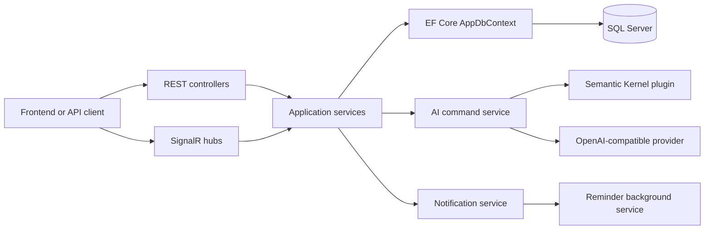

# TaskFlow Connect Backend

TaskFlow Connect is an ASP.NET Core Web API backend for a university group project. It supports workspaces, channels, messages, projects, tasks, notifications, SignalR hubs, and a Semantic Kernel AI service layer.

Repository: https://github.com/WalterCQ/SWE310-TaskFlow-Connect

## Scope

- Implemented: backend structure, EF Core models, DbContext, service layer, REST controllers, SignalR hubs, notification reminders, Semantic Kernel plugin/service placeholders, Docker Compose.
- Not implemented: `AuthController`, register/login API, JWT issuing, password hashing, and user registration flow.
- Auth integration is prepared through `CurrentUserService`, `PermissionService`, JWT Bearer configuration, and TODO comments where `[Authorize]` should be enabled.

## Collaboration

The repository owner can invite teammates from GitHub:

1. Open the repository page.
2. Go to `Settings` -> `Collaborators and teams`.
3. Click `Add people`, enter each teammate's GitHub username or email, and send the invitation.

After accepting the invitation, teammates can clone and work on branches:

```bash
git clone https://github.com/WalterCQ/SWE310-TaskFlow-Connect.git
cd SWE310-TaskFlow-Connect
git checkout -b feature/your-task-name
```

## Run Locally

```bash
cd /Users/walter/Code/SWE310/Final_Project/backend/TaskFlow.Api
dotnet restore
dotnet build
dotnet run
```

Development mode uses a temporary fallback user from `appsettings.Development.json` so the backend can be tested before the real JWT module is connected.

## API Documentation

Swagger UI:

- Local `dotnet run`: http://localhost:5134/swagger
- Docker Compose: http://localhost:5080/swagger

OpenAPI JSON:

- Local `dotnet run`: http://localhost:5134/swagger/v1/swagger.json
- Docker Compose: http://localhost:5080/swagger/v1/swagger.json

## Database

The backend uses SQL Server through `ConnectionStrings:DefaultConnection`.

```bash
dotnet ef migrations add InitialCreate
dotnet ef database update
```

If `dotnet ef` is not installed:

```bash
dotnet tool install --global dotnet-ef
```

## Docker

```bash
cd /Users/walter/Code/SWE310/Final_Project
docker compose up --build
```

The backend is exposed at `http://localhost:5080`. SQL Server is exposed at `localhost:1433`.

Optional Redis placeholder:

```bash
docker compose --profile redis up --build
```

Redis is included only as a future SignalR scale-out placeholder; the app does not require it yet.

## AI Configuration

Configure these values with environment variables, user secrets, or `appsettings.json`:

- `AI:Provider=OpenAICompatible`
- `AI:ApiKey`
- `AI:Model`
- `AI:Endpoint`

Do not commit real API keys. If `AI:ApiKey` is empty, AI endpoints return deterministic fallback responses instead of calling an LLM.

## Architecture


